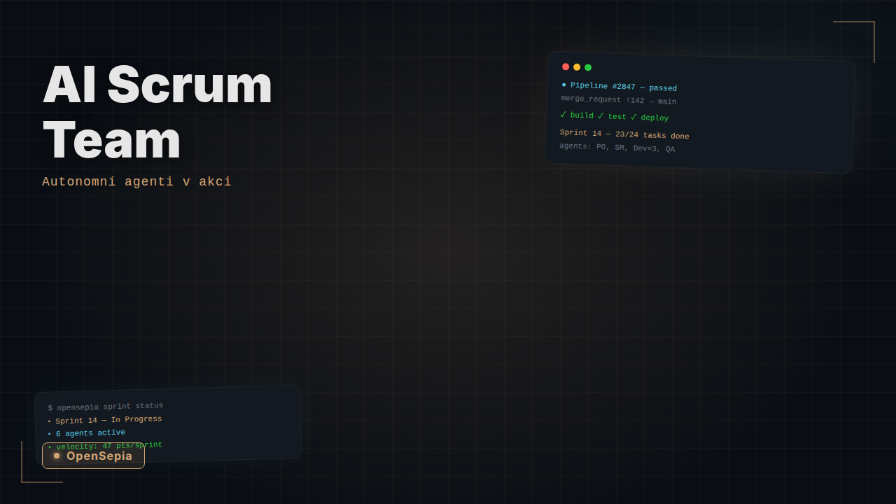

# AI Dev Team

**Autonomous software development team powered by Claude AI agents**

9 specialized AI agents collaborate as a real agile team — they plan sprints, write code, do code reviews, test, handle security audits, and manage deployments. Fully autonomous, 24/7, orchestrated by cron.

> No API key needed — runs on Claude Code CLI with a Pro or Max subscription.

## Demo

<!-- TODO: Add demo video here -->
<!-- [](https://youtube.com/watch?v=YOUR_VIDEO_ID) -->

**See it in action:** We gave the team a one-paragraph brief to build a RAG application. It ran overnight and produced 28 user stories, 3,600 lines of code, 400+ tests, and 10 merged MRs on GitLab — all fully autonomously. See [examples/rag-app/](examples/rag-app/) for the initial brief and results.

---

## What Makes This Different

Unlike other multi-agent frameworks (CrewAI, AutoGen, MetaGPT, OpenAI Swarm/Symphony), AI Dev Team is **truly autonomous**:

| | Other frameworks | AI Dev Team |
|---|---|---|
| **Execution** | One-shot task → result | Continuous, runs 24/7 via cron |
| **State** | Lost between runs | Persistent board, sprints, backlog |
| **Collaboration** | Task handoff within a session | Persistent cross-cycle reviews, QA testing, PO acceptance |
| **Planning** | Human plans tasks | PO creates stories, PM assigns, team self-organizes |
| **Project management** | External | Built-in sprints + GitLab/GitHub board sync |
| **Human input** | Required per task | Write a brief, go to sleep, check results in the morning |
| **Dependencies** | Heavy frameworks, API keys | Bash + Python + `pyyaml`, no API key |

---

## How It Works

```
                    ┌─────────────────────────────────────┐
                    │       CRON (every 40 minutes)        │
                    │        orchestrator_cli.sh            │
                    └──────────────┬──────────────────────┘
                                  │
                    ┌──────────────▼──────────────────────┐
                    │        run_agent_cli.py               │
                    │   runs agents one by one              │
                    │   via claude --print --allowedTools   │
                    └──────────────┬──────────────────────┘
                                  │
          ┌───────────────────────┼───────────────────────┐
          │                       │                       │
          ▼                       ▼                       ▼
   ┌─────────────┐     ┌──────────────────┐     ┌──────────────┐
   │  🟣 Product  │     │   📋 Board       │     │ 🔗 GitLab /  │
   │    Owner     │◄───►│                  │◄───►│   GitHub     │
   ├─────────────┤     │  sprint.md       │     │              │
   │  🔵 Project  │     │  backlog.md      │     │  Issues      │
   │    Manager   │     │  standup.md      │     │  MRs / PRs   │
   ├─────────────┤     │  inbox/*.md      │     │  Comments    │
   │  🟢 Dev 1    │     │  decisions.md    │     │              │
   ├─────────────┤     │  architecture.md │     └──────┬───────┘
   │  🟩 Dev 2    │     └──────────────────┘            │
   ├─────────────┤                                      │
   │  🟠 DevOps   │     ┌──────────────────┐            │
   ├─────────────┤     │  🗂️ Git Repo     │◄───────────┘
   │  🔴 Tester   │────►│                  │
   ├─────────────┤     │  feature branch  │
   │  🛡️ Sec Team │     │  → push → MR    │
   │  (3 agents)  │     │  → auto-merge   │
   └─────────────┘     └──────────────────┘
```

### One Cycle (~40 minutes)

1. **PO** reads the board, defines priorities and stories
2. **PM** coordinates the sprint, assigns work to developers
3. **Dev1 + Dev2** implement features, write tests, review each other's code
4. **DevOps** handles Docker, infrastructure, deployment config
5. **Tester** runs functional reviews, verifies acceptance criteria
6. **Git sync** → feature branch → push → MR/PR → auto-merge
7. **Board sync** → issues updated on GitLab/GitHub

Agents communicate via **inbox files** — Markdown messages they send to each other. After each cycle, inboxes are archived and the next cycle starts fresh.

---

## The Team

### Core Team (runs every cycle)

| Agent | Role | What they do |
|-------|------|-------------|
| 🟣 **Product Owner** | Product strategist | Defines vision, writes user stories, prioritizes backlog, accepts/rejects work |
| 🔵 **Project Manager** | Coordinator | Manages sprint, assigns stories to devs, resolves blockers |
| 🟢 **Developer 1** | Full-stack dev | Implements features, writes tests, reviews Dev 2's code |
| 🟩 **Developer 2** | Full-stack dev | Implements features, writes tests, reviews Dev 1's code |
| 🟠 **DevOps Engineer** | Infrastructure | Docker, docker-compose, deployment, monitoring |
| 🔴 **QA Engineer** | Quality | Functional review, testing, acceptance criteria verification, bug reports |

### Security Team (runs separately, e.g. daily)

| Agent | Role | What they do |
|-------|------|-------------|
| 🛡️ **Security Analyst** | Security reviewer | OWASP Top 10 review, vulnerability analysis, security audit |
| 🔐 **Security Engineer** | Security implementer | Implements security fixes, hardening, CSP/CORS |
| 💀 **Penetration Tester** | Red teamer | Attack simulation, PoC exploits, attacker's perspective |

---

## Quick Start

### Prerequisites

- **Claude Code CLI** — install with `npm install -g @anthropic-ai/claude-code`, then `claude login`
- **Claude Pro or Max subscription** — Pro ($20/mo) handles minimal team, Max ($100/mo) recommended for full team
- **Python 3.10+** with `pyyaml` (`pip install pyyaml`)
- **Git** (optional: GitLab or GitHub repo for full integration)
- **Isolated environment** (recommended) — VM, LXC container, or Docker container

> **Important:** The agents have access to shell tools and will create files, run commands, and modify the workspace. We strongly recommend running AI Dev Team in a dedicated, isolated environment (VM, LXC, Docker) to prevent unintended changes to your host system.

> **How it works under the hood:** Each agent is executed via `claude --print` with a carefully crafted system prompt and context. The orchestrator calls Claude Code CLI for each agent in sequence — no API key needed, it uses your Claude subscription directly.

### Setup

```bash
# 1. Clone and install
git clone https://github.com/CelaenoIndustry/OpenSepia.git
cd ai-team
pip install -r requirements.txt

# 2. Configure environment (optional — for GitLab/GitHub integration)
cp config/.env.example config/.env
# Edit config/.env with your tokens

# 3. Initialize a project
python3 scripts/init_project.py "My Project" "Description of what to build"

# 4. Run your first cycle
./scripts/orchestrator_cli.sh dev-team
```

### Run Modes

| Mode | Command | Agents | Use case |
|------|---------|--------|----------|
| **dev-team** | `orchestrator_cli.sh dev-team` | 6 (core team) | Regular development |
| **minimal** | `orchestrator_cli.sh minimal` | 3 (PO, Dev1, Tester) | Save rate limits |
| **security** | `orchestrator_cli.sh security` | 3 (sec team) | Security audit |
| **all** | `orchestrator_cli.sh all` | 9 (everyone) | Full team |
| **single** | `orchestrator_cli.sh dev1` | 1 | Debug a single agent |

### Automated Runs (Cron)

```bash
# Dev team every 2 hours during work hours
0 8-22/2 * * * /path/to/ai-team/scripts/orchestrator_cli.sh dev-team >> /path/to/ai-team/logs/cron.log 2>&1

# Security audit once daily at 6:00 AM
0 6 * * * /path/to/ai-team/scripts/orchestrator_cli.sh security >> /path/to/ai-team/logs/cron.log 2>&1
```

---

## Communication Model

Agents communicate via shared Markdown files on the **board**:

```
board/
├── sprint.md          ← Current sprint with stories and statuses
├── backlog.md         ← Product backlog with priorities
├── standup.md         ← Standup reports from each cycle
├── decisions.md       ← Architecture and technical decisions
├── architecture.md    ← System architecture
├── project.md         ← Project description and tech stack
│
└── inbox/             ← Messages between agents
    ├── po.md          ← Messages FOR the Product Owner
    ├── pm.md          ← Messages FOR the Project Manager
    ├── dev1.md        ← Messages FOR Developer 1
    ├── dev2.md        ← Messages FOR Developer 2
    ├── devops.md      ← Messages FOR the DevOps Engineer
    └── tester.md      ← Messages FOR the QA Engineer
```

**How a cycle works:**

1. Agent wakes up and reads its inbox + sprint.md
2. Processes messages and does its work (writes code, tests, reviews...)
3. Writes messages to other agents' inboxes
4. Updates sprint.md and standup.md
5. Its inbox is archived to `board/archive/`

### Story Workflow

```
TODO → IN_PROGRESS → REVIEW → TESTING → DONE
```

1. **PO** creates a story with acceptance criteria
2. **PM** assigns it to a developer
3. **Dev** implements and sends for code review
4. **Other dev** does code review (approve/request changes)
5. **QA** functional testing + criteria verification
6. **PO** accepts or rejects

---

## Sprint System

The project runs in **sprints** of **10 cycles** (~7 hours of real time with 40-min intervals).

At the end of each sprint:
- PO and PM run a retrospective
- Sprint counter auto-increments
- Board syncs with the new sprint

---

## Integrations

AI Dev Team works standalone with just Markdown files on disk. But when you connect it to GitLab or GitHub, it becomes a full-featured development pipeline with issues, Kanban boards, merge requests, and auto-merge.

### GitLab / GitHub Setup

Both are supported as interchangeable providers. Configure one in `config/.env`:

```bash
# Option A: GitLab
GITLAB_URL=https://gitlab.example.com
GITLAB_TOKEN=glpat-xxxxx
GITLAB_PROJECT_ID=group/project

# Option B: GitHub
GITHUB_TOKEN=ghp_xxxxx
GITHUB_OWNER=your-org
GITHUB_REPO=your-repo
```

The active provider is **auto-detected** from environment variables. If both are set, GitLab takes priority.

Then initialize:
```bash
python scripts/init_integrations.py
```

This creates labels, sets up the board, clones the repo, and verifies Docker.

### How the Board Sync Works

Every cycle, the orchestrator syncs the local Markdown board with GitLab/GitHub:

```
board/backlog.md  ──┐
                    ├──► sync_board.py ──► GitLab/GitHub Issues
board/sprint.md   ──┘
```

**Stories become Issues:**

Each `### STORY-XXX: Title` in backlog.md or sprint.md maps to one Issue on GitLab/GitHub. The issue title includes the story ID: `[STORY-001] User authentication`.

**Labels represent status and priority:**

| Markdown status | Label on GitLab/GitHub |
|----------------|----------------------|
| `TODO` | `status::todo` |
| `IN_PROGRESS` | `status::in-progress` |
| `REVIEW` | `status::review` |
| `TESTING` | `status::testing` |
| `DONE` | `status::done` |
| `BLOCKED` | `status::blocked` |

| Priority | Label |
|----------|-------|
| CRITICAL | `priority::critical` |
| HIGH | `priority::high` |
| MEDIUM | `priority::medium` |
| LOW | `priority::low` |

Bug stories also get the `type::bug` label.

**Kanban board** — GitLab/GitHub boards can display issues by `status::*` labels, giving you a visual Kanban view of the sprint.

**Bidirectional sync:**
- When an agent changes a status in sprint.md → the corresponding issue label updates on GitLab/GitHub
- When a story moves to `DONE` → the issue is automatically closed
- When a closed story is reopened in sprint.md → the issue reopens on GitLab/GitHub

### Agent Comments → Issue Comments

When agents write to `board/inbox/`, messages that reference `STORY-XXX` or `BUG-XXX` are automatically posted as comments on the corresponding issue:

```
board/inbox/dev1.md contains:
  "Implemented STORY-005: added /users endpoint..."
       │
       ▼
  GitLab/GitHub Issue #5 gets a comment:
  "🟢 Developer 1: Implemented STORY-005: added /users endpoint..."
```

Standup reports from `board/standup.md` are also synced as consolidated comments on relevant issues.

### Git Workflow

Code flows from the local workspace to the remote repo every cycle:

```
workspace/src/ ──rsync──► local repo ──► feature branch ──► push ──► MR/PR ──► auto-merge
```

**Branch naming**: `ai-team/story049-story050-s16c5`
- Contains the story IDs being worked on
- `s16c5` = sprint 16, cycle 5

**Commit messages**: `feat(story049-story050): sprint 16 cycle 5`

**Auto-merge** (`scripts/merge_approved_mrs.py`):
- Every cycle, the orchestrator checks for approved MRs/PRs on `ai-team/*` branches
- If approved → auto-merged to main
- Stale branches (2+ days without activity or approvals) are automatically closed
- Only merges branches prefixed with `ai-team/` — never touches your branches

### Merge Request / Pull Request Flow

```
Dev1 implements STORY-001        Dev2 implements STORY-002
         │                                │
         ├─ feature branch                ├─ feature branch
         ├─ writes code                   ├─ writes code
         ├─ creates MR/PR ◄── review ────┤
         │                                │
         ├──── review ─────────────────► MR/PR
         │                                │
    Tester: functional review         Tester: functional review
    Security: security review         Security: security review
         │                                │
         ▼                                ▼
      merge                            merge
         │                                │
         └──────────► main ◄──────────────┘
```

### Code Reviews on MRs

When an agent writes a code review or QA review that references a story (e.g. `STORY-005`), the system automatically:
1. Finds the open MR whose branch contains that story ID
2. Posts the review comment directly on the MR
3. If the review contains approval keywords (`approve`, `lgtm`, `looks good`, `approved`) — automatically approves the MR

This means code reviews are visible directly on merge requests in GitLab/GitHub, not just in local inbox files.

### Docker

DevOps agent creates and manages:
- `Dockerfile` — multi-stage builds (template in `templates/docker/`)
- `docker-compose.yml` — local development with app, database, Redis
- Environment configuration

### Board Resilience

The board state lives in Markdown files on disk (`sprint.md`, `backlog.md`, etc.). The orchestrator protects against data loss with two mechanisms:

**1. Automatic snapshots** — before every cycle, the orchestrator copies all critical board files to `board/.snapshot/`:
```
board/.snapshot/
├── sprint.md.bak
├── backlog.md.bak
├── project.md.bak
├── architecture.md.bak
└── decisions.md.bak
```

**2. Auto-restore** — if a critical file (sprint.md or backlog.md) is missing or empty at the start of a cycle, the orchestrator automatically:
1. Tries to restore from the local snapshot
2. If that fails, reconstructs the board from GitLab/GitHub issues

You can also trigger these manually:
```bash
# Check board health
python scripts/restore_board.py --check

# Restore from local snapshot
python scripts/restore_board.py --from-snapshot

# Reconstruct from GitLab/GitHub issues
python scripts/restore_board.py --from-provider
```

### Working Without Integrations

Everything works without GitLab/GitHub — agents still:
- Communicate via inbox files
- Write code to `workspace/src/`
- Track stories in sprint.md and backlog.md
- Do code reviews and QA

The integration adds external visibility, automated git workflow, and an additional layer of board state backup (issues on the server mirror the local board).

---

## Project Structure

```
ai-team/
├── config/
│   ├── agents.yaml          # Agent definitions and system prompts
│   ├── project.yaml         # Sprint counter, limits, project description
│   ├── .env                 # Tokens and credentials (gitignored)
│   └── .env.example         # Template for .env
│
├── scripts/
│   ├── orchestrator_cli.sh  # Main orchestrator
│   ├── run_agent_cli.py     # Agent runner — calls claude --print
│   ├── init_project.py      # Initialize a new project
│   ├── init_integrations.py # Setup GitLab/GitHub + Git + Docker
│   ├── merge_approved_mrs.py# Auto-merge approved MRs/PRs
│   ├── sync_board.py       # Sync board ↔ GitLab/GitHub issues
│   ├── sync_comments.py    # Sync agent comments to issues
│   ├── restore_board.py    # Board health check and restore
│   └── monitor.py           # Display run statistics
│
├── integrations/
│   ├── __init__.py          # IntegrationDispatcher (central router)
│   ├── base.py              # BoardProvider ABC (shared interface)
│   ├── git_client.py        # Git operations (branch, commit, push)
│   ├── docker_client.py     # Docker/docker-compose operations
│   ├── logging_config.py    # Shared logging and env loader
│   └── providers/
│       ├── __init__.py      # Auto-detection of active provider
│       ├── gitlab.py        # GitLab API v4 client
│       └── github.py        # GitHub REST API client
│
├── board/                   # Shared board (see Communication Model)
│   ├── sprint.md
│   ├── backlog.md
│   ├── inbox/*.md
│   └── archive/
│
├── workspace/               # Project source code (agents write here)
│   └── src/
│
├── tests/                   # Pytest test suite
│
├── templates/
│   └── docker/              # Dockerfile and docker-compose templates
│
├── logs/
│   ├── cron.log             # Cron execution logs
│   └── runs/                # JSON records from each cycle
│
└── ai-team.crontab          # Crontab configuration
```

---

## Configuration

### `config/agents.yaml`

Defines 9 agents with detailed system prompts. Each agent has:
- **name** — human-readable role name
- **color** — emoji identifier
- **system_prompt** — detailed instructions for behavior, communication, and output format

### `config/project.yaml`

```yaml
project:
  name: My Project
  description: "Your project description here"
  tech_stack:
    language: python + typescript
    framework: fastapi + angular
    database: mongodb

sprint:
  current_sprint: 1
  current_cycle: 1
  cycles_per_sprint: 10

limits:
  max_tokens_per_agent: 8192
  pause_between_agents: 5    # seconds between agents
```

### `config/.env`

```bash
# GitLab (auto-detected)
GITLAB_URL=https://gitlab.example.com
GITLAB_TOKEN=glpat-xxxxx
GITLAB_PROJECT_ID=group/project

# OR GitHub (auto-detected)
GITHUB_TOKEN=ghp_xxxxx
GITHUB_OWNER=your-org
GITHUB_REPO=your-repo

# Git
GIT_REPO_URL=https://gitlab.example.com/group/project.git
GIT_REPO_PATH=/path/to/local/repo
```

### Claude Code Integration

AI Dev Team runs on **Claude Code CLI** (`claude` command). It does NOT use the Anthropic API directly — instead, it leverages your Claude Pro/Max subscription through the CLI.

**How agents are executed:**

```
orchestrator_cli.sh
    └── run_agent_cli.py
         └── claude --print \
               --allowedTools "Edit,Write,Read,Bash(...)" \
               --systemPrompt "agents.yaml system prompt" \
               --append-system-prompt "board context + inbox + standup"
```

Each agent gets:
1. **System prompt** from `config/agents.yaml` — defines the agent's role and behavior
2. **Board context** — current sprint.md, backlog.md, architecture.md
3. **Inbox messages** — messages from other agents
4. **Standup history** — previous cycle's standup report
5. **Issue discussions** — comments from GitLab/GitHub (if integration enabled)
6. **Git context** — current branch, recent commits, diff (if git enabled)

The agent responds with updated files (board updates, code, messages to other agents) in a structured format that the runner parses and writes to disk.

**Claude Code permissions:**

Agents have access to these tools:
- `Read` — read any file in the workspace
- `Write` — write files to workspace/src/ and board/
- `Edit` — edit existing files
- `Bash(python3:*)` — run Python scripts
- `Bash(npm:*)` — run npm commands
- `Bash(docker:*)` — run Docker commands (DevOps agent only)

**No API key required** — Claude Code uses your subscription. Make sure you're logged in:
```bash
claude login
claude --version   # verify it works
```

---

## Human Intervention

You can communicate with the team in two ways:

### Option 1: Inbox files (local)

Write directly to an agent's inbox file. The agent reads it in the next cycle.

```bash
# Send a message to the PM
echo "## Message from Human
STORY-003 priority is now CRITICAL. Focus on this first." >> board/inbox/pm.md

# Send a message to Developer 1
echo "## Message from Human
Please add input validation to the /upload endpoint." >> board/inbox/dev1.md
```

### Option 2: GitLab/GitHub comments (remote)

If you have GitLab or GitHub integration enabled, you can comment directly on any issue. **All agents will read your comment in the next cycle.**

Every cycle, the system fetches the latest comments from all active story issues and injects them into every agent's context as an "Issue Discussions" section. This includes:
- Comments from other agents
- **Your comments as a human**
- Comments from any other GitLab/GitHub user

This means you can give feedback, ask questions, or redirect work from anywhere — your phone, GitLab/GitHub web UI, or any API client — without SSH access to the server.

```
You comment on STORY-005:
  "The /upload endpoint should also accept .pdf files, not just .txt"
       │
       ▼ (next cycle)
All agents see in their context:
  ## Issue Discussions (from gitlab/github)
  ### STORY-005 (#12)
  - **Your Name**: The /upload endpoint should also accept .pdf files, not just .txt
```

---

## Monitoring

```bash
# Live logs
tail -f logs/cron.log

# Last cycle results
cat logs/runs/latest.json

# Sprint status
cat board/sprint.md

# Standup reports
cat board/standup.md
```

### Example cycle output

```json
{
  "timestamp": "20260215_111555",
  "method": "claude-code-cli",
  "agents": [
    {"agent": "Product Owner",   "context_chars": 9676,  "response_chars": 8689},
    {"agent": "Project Manager", "context_chars": 10715, "response_chars": 9611},
    {"agent": "Developer 1",    "context_chars": 12163, "response_chars": 3290},
    {"agent": "Developer 2",    "context_chars": 10884, "response_chars": 6581},
    {"agent": "DevOps Engineer", "context_chars": 9917,  "response_chars": 2994},
    {"agent": "QA Engineer",    "context_chars": 11533, "response_chars": 1250}
  ]
}
```

---

## Example: Build a RAG App Overnight

Want to see AI Dev Team in action? Give it a brief and let it build a full RAG (Retrieval-Augmented Generation) application:

```bash
# 1. Initialize the project
python3 scripts/init_project.py "RAG App" \
  "Production-ready RAG system. Upload PDF/TXT/MD documents, chunk and embed them, \
   store in ChromaDB, query via natural language with Claude API. \
   FastAPI backend, Angular 18 frontend, MongoDB, Docker Compose."

# 2. (Optional) Send a detailed brief to the PO for more control
cp examples/rag-app/po-brief.md board/inbox/po.md

# 3. Start the team
./scripts/orchestrator_cli.sh dev-team

# 4. Set up cron and go to sleep
crontab ai-team.crontab
```

**After one night (50 cycles):**
- 28 user stories created and managed
- 26 stories completed across 6 sprints
- ~3,600 lines of backend code (FastAPI, 18 services, 8 routers)
- Angular frontend with chat and document management UI
- 400+ tests with 80%+ coverage
- Docker Compose with health checks
- CI/CD pipeline
- Security audit completed
- 10 MRs merged on GitLab

See [examples/rag-app/](examples/rag-app/) for the full brief and detailed results.

---

## Rate Limits

| Plan | Messages/5h | Recommended cycles/day | Agents per cycle |
|------|-------------|----------------------|-----------------|
| **Pro** ($20/mo) | ~45 | 3-4 | 3 (minimal) |
| **Max** ($100/mo) | ~225 | 15-20 | 6-9 (full team) |

---

## Testing

```bash
# Run all tests
python3 -m pytest tests/ -v

# Run a specific test file
python3 -m pytest tests/test_sync_board.py -v
```

Tests cover:
- Board provider labels and constants
- Git and Docker configuration validation
- Provider auto-detection (GitLab/GitHub)
- Backlog and sprint parsing
- Status normalization
- Story/bug reference extraction from agent messages
- MR/PR reference extraction
- Board health check and restore logic

No external API calls — all provider interactions are mocked.

---

## Extending

### Adding a New Agent

1. Add the agent definition to `config/agents.yaml`
2. Add the agent ID to the desired execution order in `global`
3. Create `board/inbox/{agent_id}.md`

### Adding a New Provider

Implement the `BoardProvider` ABC from `integrations/base.py`:

```python
from integrations.base import BoardProvider

class GiteaProvider(BoardProvider):
    @property
    def name(self) -> str:
        return "gitea"

    # Implement all abstract methods...
```

Add detection logic to `integrations/providers/__init__.py`.

---

## License

MIT
